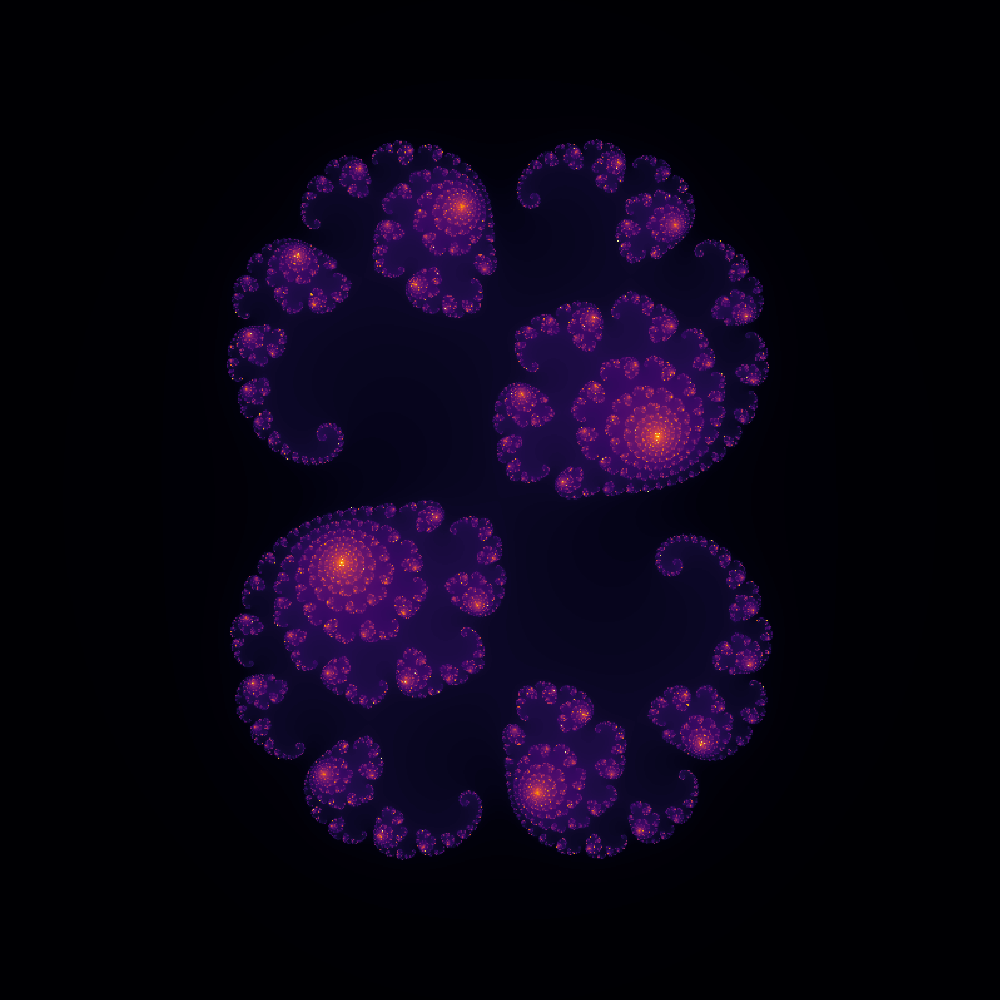

# 🌌 Explore the Julia Set

This repository provides tools to generate and visualize 2D Julia fractals using Python. By adjusting parameters, you can explore the dynamics of complex functions and create unique visualizations of the Julia set.



## Features

- **Customizable Parameters**: Adjust size, zoom, and iteration limits to refine the fractals.
- **Interactive Exploration**: Use the provided Jupyter Notebook for step-by-step computation and visualization.
- **Standalone Script**: Quickly generate and save fractal images with the Python script.
- **High-Quality Visualization**: Save fractals as high-resolution images for further use.

## Repository Structure

- **`julia.ipynb`**: A Jupyter Notebook to explore and visualize Julia sets interactively.
- **`julia.py`**: A standalone Python script to generate Julia sets programmatically.
- **`images/`**: Contains example images and fractal visuals.

## Requirements

To run the code, ensure the following dependencies are installed:

- Python 3.8 or higher
- NumPy
- Matplotlib
- Jupyter Notebook (optional)

Install the required libraries with pip:

```bash
pip install numpy matplotlib
```

## How It Works

1. **Define the Iteration Rule**: The function `my_func` determines how complex numbers are iteratively transformed.
2. **Generate the Julia Set**: The `julia_set` function maps the complex plane and calculates iteration counts for each pixel.
3. **Visualize the Result**: The 2D array of iteration counts is displayed as a colorful fractal image using Matplotlib.

For detailed documentation, check the code in `julia.ipynb` and `julia.py`.

## License

This project is licensed under the MIT License.
